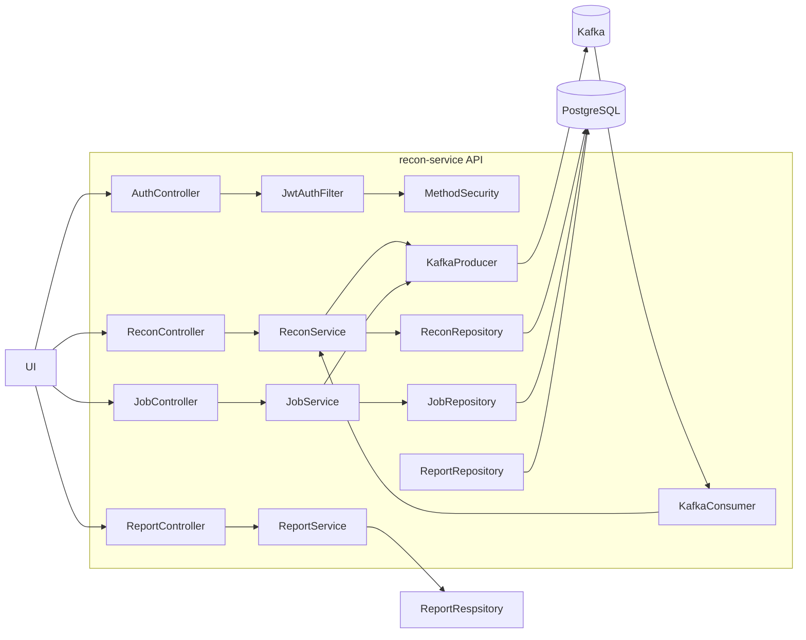

```mermaid
flowchart LR

UI[UI]
subgraph API["recon-service API"]

AuthController
ReconController
JobController
ReportController

JwtAuthFilter
MethodSecurity

ReconService
JobService
ReportService

ReconRepository
JobRepository
ReportRepository

KafkaProducer
KafkaConsumer

end

Postgres[(PostgreSQL)]
Kafka[(Kafka)]

UI --> AuthController
UI --> ReconController
UI --> JobController
UI --> ReportController

AuthController --> JwtAuthFilter
JwtAuthFilter --> MethodSecurity

ReconController --> ReconService
JobController --> JobService
ReportController --> ReportService

ReconService --> ReconRepository
JobService --> JobRepository
ReportService --> ReportRespsitory

ReconRepository --> Postgres
JobRepository --> Postgres
ReportRepository --> Postgres

ReconService --> KafkaProducer
JobService --> KafkaProducer

KafkaProducer --> Kafka
Kafka --> KafkaConsumer

KafkaConsumer --> ReconService
```
